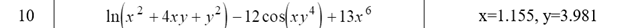
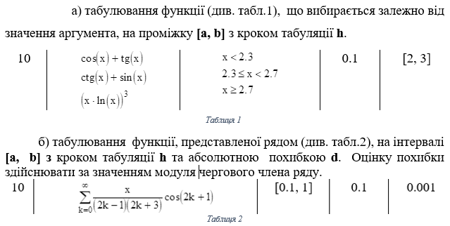
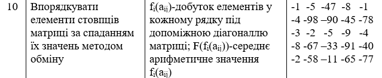
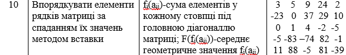

# a-warm-place-2017
୧༼ಠ益ರೃ༽୨

**Теми до лабораторних робіт:**

**_1."Прості програми лінійної структури в мові програмування C++"_**

**_2."Програми з розгалуженими та циклічними алгоритмами"_**

**_3."Робота з масивами. Використання функцій"_**

**_4."Класові типи. Використання класових типів та управління об'єктами"_**

